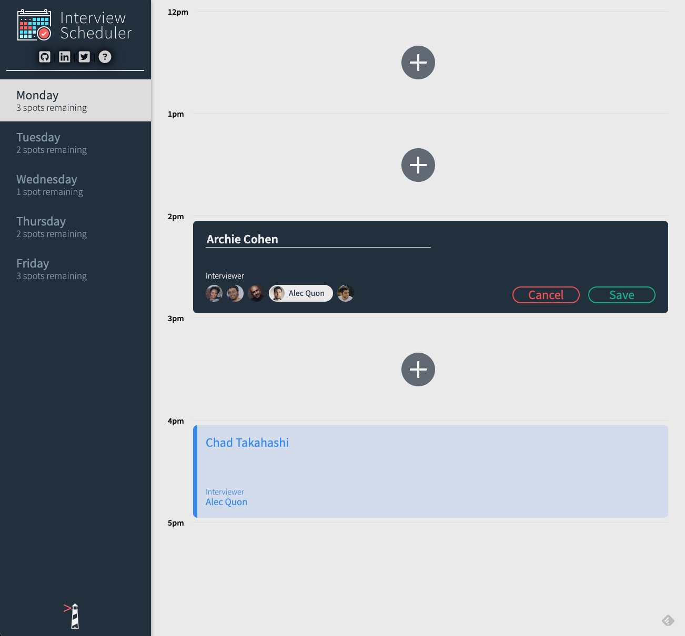
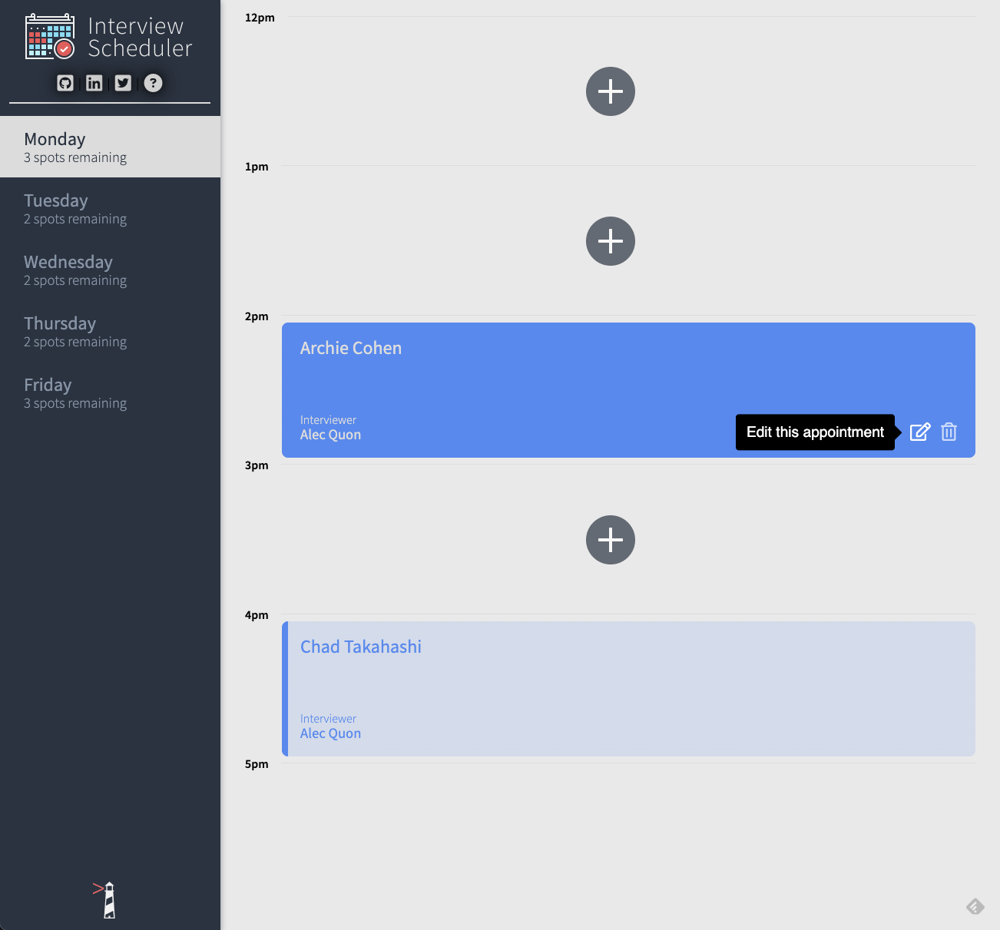
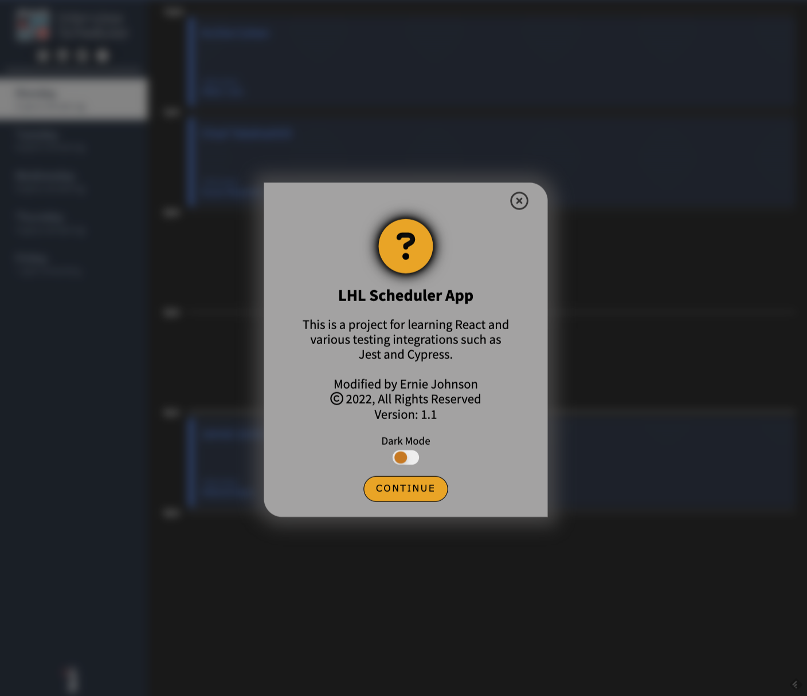
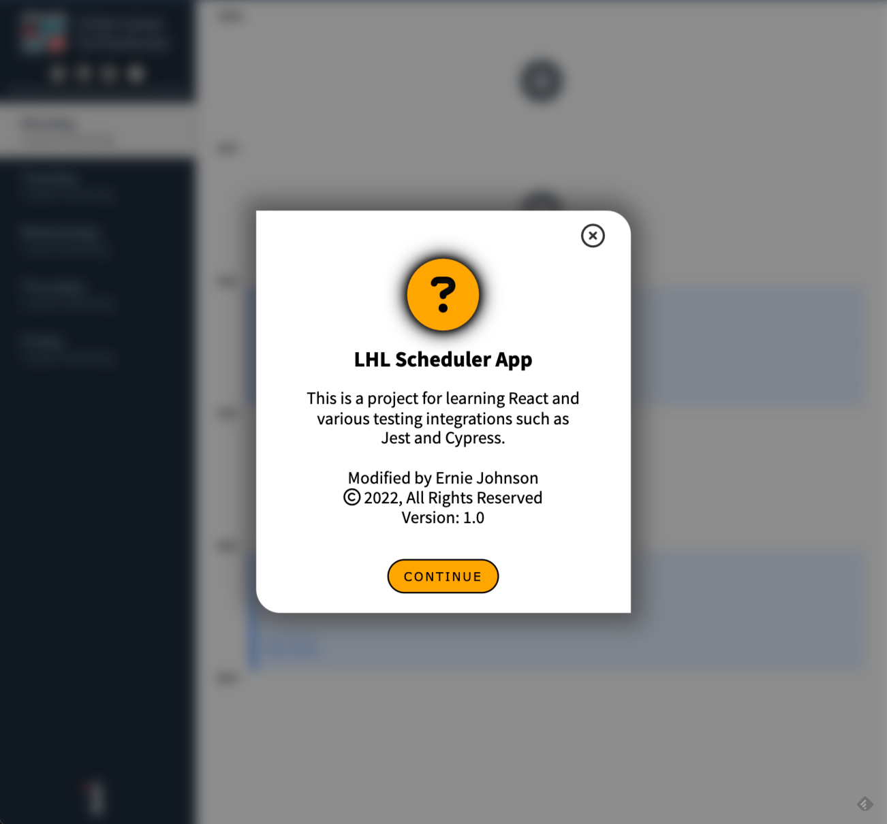

# LHL Scheduler

Scheduler is a basic application created for <a href="www.lighthouselabs.ca">LightHouseLabs.ca</a> to exercise our skills to date in the course with Javascript and ReactJS.  An introduction to Storybook React component builder was also implemented.

Scheduler also builds upon our learning to implement Jest and Cypress test platforms.  * Test modules were extensively modified to work with our extra features like modal windows in this version.


---
## Contents...
1. [Getting Started](#getting-started)
2. [Features](#features)
3. [Future Plans](#future-plans)
4. [Known Bugs](#known-bugs)
5. [Attributions](#attributions)
6. [Updates](#updates)
---
## Getting Started
Clone the repository to your computer. You'll also need the scheduler server and SQL data that is available on a separate github repository [here](https://github.com/lighthouse-labs/scheduler-api).

Install dependencies with `npm install`.

1. Run Webpack Development Server

```sh
npm start
```

2. Run Jest Test Framework

```sh
npm test
```

3. Run Storybook Visual Testbed

```sh
npm run storybook
```
4. Visit `http://localhost:8000/` in your web browser to start Scheduler app.  
[( back to top 🔺)](#lhl-scheduler)
---
## Features...
- create, add, edit and delete scheduled interviews through any of the days
- jump to different day of the week through the left sidebar



## Bonus features...
- start app on "today" vs a default of Monday - if used on Saturday or Sunday, then default to Monday
- prevent opening form/edits if delete confirmation panel is open
- limit interview add form to only 1 spot at a time (original code allowed multiple forms open needlessly)
- create modal window react component for:
  - cookies notice and privacy policy modal windows
  - about Scheduler modal window
- create reusable "tooltips" react component
- add social media links  
     

- dark / light mode toggle is also implemented - toggle mode via the 'about (? icon)' modal window 
     
[( back to top 🔺)](#lhl-scheduler)
---
## Future Plans...
- continued grown and experimentation through ReactJS components  
[( back to top 🔺)](#lhl-scheduler)
---
## Known Bugs...
- none known
- be sure to report any found bugs on Github!  
[( back to top 🔺)](#lhl-scheduler)
---
## Attributions...
- FontAwesome (various icons)
- Node.js
- PostgreSQL
- SCSS (CSS)
- ReactJS  
[( back to top 🔺)](#lhl-scheduler)
---
## Updates...
- Get the latest of our version of Scheduler on [Github here](https://github.com/ej8899/scheduler).
- A front end dashboard is also available [here](https://github.com/ej8899/scheduler-dashboard)  
    
[( back to top 🔺)](#lhl-scheduler)
---
